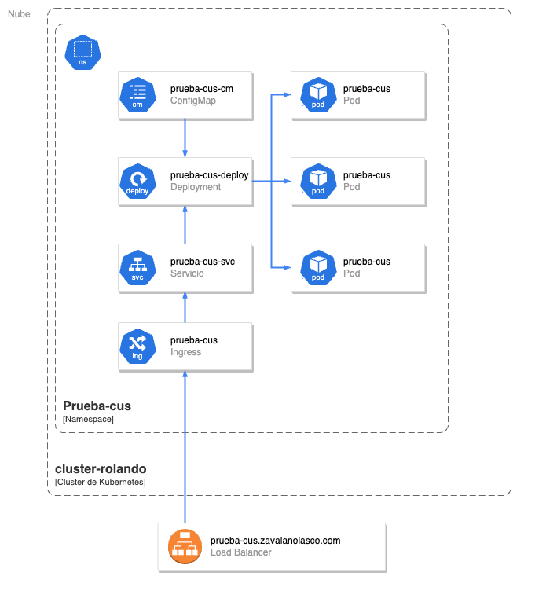
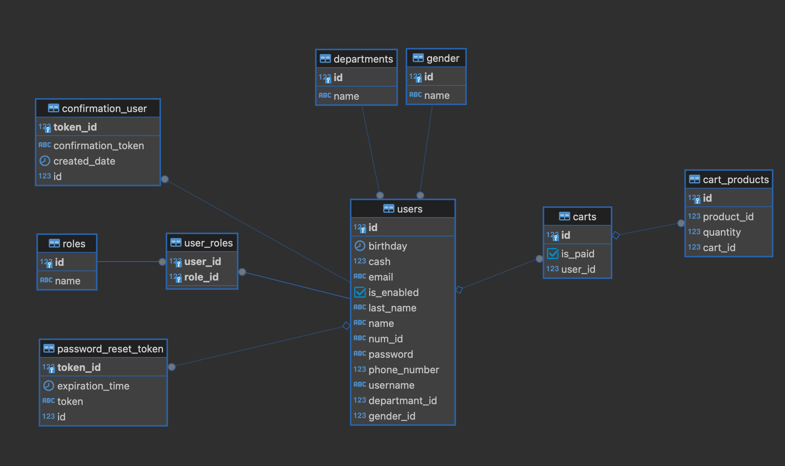
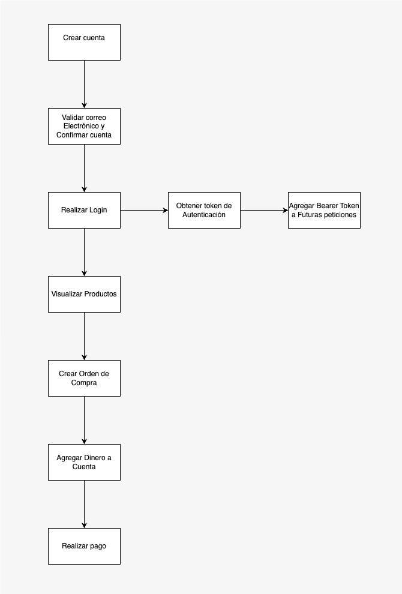

# Prueba Cus Proyecto

## Definición

Este proyecto consiste en una simulación de una api de tienda contando con los siguientes modulos:

- Products
- User/Auth
- Carts
- Account-money

Cabe mencionar que el proyecto se encuentra desplegado y en correcto funcionamiento en [https://prueba-cus.zavalanolasco.com](https://prueba-cus.zavalanolasco.com)

## Diagrama de Infraestructura


## Diagrama Entidad - Relación de la Base de Datos



## Detalle de Modulos

### Products

Este modulo funciona como un proxy de la api ```https://fakestoreapi.com``` el cual nos entrega una seride productos y su información, las uris correspondientes a este modulo son:
- /products/all
    - Retorna todos los productos.
    - Este endpoint no requiere autenticación.
- /products/{id}
    - Donde "id" es un valor de tipo entero.
    - Retorna un producto segun el id que enviemos.

### User/Auth

Este modulo se encarga de la seguridad del sistema, la cual es programada con spring security, existen dos roles en el sistema los cuales son:
- Admin
- User
Los endpoints que requieren autenticación deben enviar su Bearer Token en los headers de la petición.

Cabe recalcar que los endpoints que requieren estan autenticación son los de Carts y AccountMoney

#### Endpoints:

- /auth/register
    - body:
```json
{
    "email" : "zrolando1015@gmail.com",
    "username" : "rzavala",
    "name": "Rolando",
    "lastName": "Zavala",
    "password": "1234",
    "genderId": 1,
    "departmentId": 3,
    "phoneNumber": 96202751,
    "numId": "0801190012345",
    "birthday": "15/10/1998",
    "roles": ["ADMIN", "USER"]
}
```
    - genderId
        - 1 -> Masculino
        - 2 -> Femenino
    - departmentId:
        - Del 1 al 18 en orden alfabetico segun los departamentos de Honduras
    - Nota: Es importante colocar un correo existente ya que enviara un correo para validar su cuenta
- /login
    - body:
```json
{
    "username": "rzavala",
    "password": "1234"
}
```
    - Nos retornara un token el cual requerimos para los edpoints de carts y accountMoney


- auth/confirm-account?token={token}
    - Endpoint de confirmación de cuenta.
    - El token se encuentra en el correo recibido al registrarse
- /auth/password-reset-request
- /auth/reset-password?token=58c21e2e-b516-4664-a378-0d0653495ae4

### Carts

Este endpoint se encarga de crear las ordenes, validar que los productos ingresados existan, brindarnos los subtotales segun producto y su respectivo total

#### Endpoints:
- /carts/add
    - Este endpoint nos sirve para crear nueestras propias ordenes de compra
    - Debemos estar loggeados ya que esta orden se anidara nuestra cuenta automaticamnte
    - Una orden de compra es una lista donde debemos especificar el codiigo del producto y la cantidad de productos que se requieren.
    - body:
```json
{
    "products": [
      {

        "productId": 1,
        "quantity": 4
      },
      {

        "productId": 7,
        "quantity": 1
      },
      {

        "productId": 3,
        "quantity": 6
      }
    ]
  }
```
    - Obtendremos el siguiente detalle de compra:

```json 
{
    "order": {
        "id": 15,
        "username": "rzavala",
        "email": "zrolando1015@gmail.com",
        "name": "Rolando",
        "products": [
            {
                "title": "Fjallraven - Foldsack No. 1 Backpack, Fits 15 Laptops",
                "price": 109.95,
                "quantity": 4,
                "subTotal": 439.79998779296875
            },
            {
                "title": "White Gold Plated Princess",
                "price": 9.99,
                "quantity": 1,
                "subTotal": 9.989999771118164
            },
            {
                "title": "Mens Cotton Jacket",
                "price": 55.99,
                "quantity": 6,
                "subTotal": 335.94000244140625
            }
        ],
        "total": 785.7299900054932,
        "paid": false
    },
    "responseAdvisor": {
        "errorCode": 200,
        "statusError": "SUCCESS",
        "errorMessages": []
    }
}
```

     - Como podemos observar en el campo "paid", esta orden no ha sido paga y ha sido exitosamente anidada a nuestra cuenta.

- carts/data/{filtro}
    - Nos retorna una lista de todo las ordendes segun los siguientes filtros:
        - carts/data/all -> Todas las ordenes.
        - carts/data/my_pendings -> Todas las ordenes pendientes de pago de la cuenta loggeada.
        -  - carts/data/my_paids -> Todas las ordenes pagadas de la cuenta loggeada.
- /carts/{id}
    - Nos retorna la orden de pago segun id
    
- /carts/delete/{id}
    - Eliminar una orden de compra según su id


### Account-Money

Este modulo engloba los endpoints relacionados a los pagos.
Al crear una cuenta en el sistema, esta misma automaticamente cuenta con 0 Lps, por lo que debemos realizar depositos a la cuenta, caso contrario el sistema no permitira realizar pagos.

#### Endpoins:

- /account-money/add
    - Nos permite depositar dinero a nuestra cuenta para efectuar pagos.
    - A través del Bearer Token tomara nuestra cuenta y depositar el dinero
    - body:

```json
{
    "cash": "1000"
}
```
Una vez depositado tendremos este response donde nos indica el saldo de la cuenta:
```json
{
    "account": {
        "username": "rzavala",
        "cash": 3000.0
    }
}
```
- /account-money/all
    - Retorna las cuentas de todos los usuarios --> Solo con permiso Admin
- /account-money
    - Retorna nuestro estado de cuenta
- /account-money/pay/{id}
    - Endpoints de pago -> debemos especificar el id de la orden que deseamos pagar, el sistema validara que la cuenta tenga fondos suficientes, que no haya sido pagada antes y que exista.
    - Una vez confirmado procede a realizar el pago.

    ## Flujo de una compra exitosa

    

    ## Variables de Entorno

    - database_name -> Nombre de Base de Datos (PostgresSQL)
    - from_address -> Correo con el que se enviaran notificaciones 
    - frontend_host -> URL de FrontEnd (Esto para cuando la confirmación de correo tenga UI)
    - postgres_host -> URL de Base de datos
    - postgres_password -> Contraseña de Base de datos
    - postgres_username -> Usuario de Base de datos
    - products_api_url -> Url de Api de Prodcutos
    - secret_key -> Llave para encriptar JWT
    - sendgrid_api_key -> token de sengrid (Servicio de email)  


